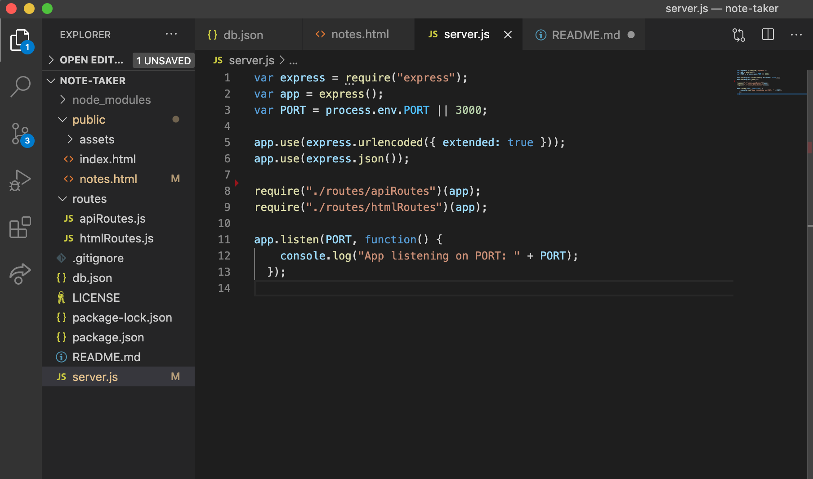
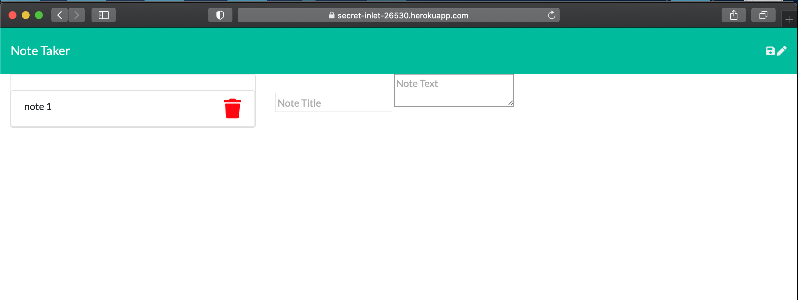

# note-taker

## Description 

I wanted to create an application that enabled me to take notes and save them online to organize and keep track of my thoughts for the day. This was a challenging assignment for me and was the first time I experienced utilizing express and posting and getting API calls to create a dynamically updated application.

Future development for this project will include fixing up the UI to have a more appealing look and greater functionality. A simple start to this will be to make the text area larger and customize the colors. 

## Table of Contents
* [Installation](#installation)
* [Usage](#usage)
* [Credits](#credits)
* [License](#license)
   
## Installation

The installation of this project is to access my github repository and then click on note-taker or click this link [note taker](https://github.com/hondahelix/note-taker) then click on the green code button in the top right corner. Then you can copy and paste the code via ssh or by downloading a zip file. Once you have downloaded the file there are a couple of things that must be downloaded in order for this application to run properly. The first is node.js once this is downloaded open up the terminal and navigate to the file that this project is saved in. Then run the code:
npm i 
This should download express. Then all that is left to do is run the command:
node server.js 
then go to the browser and type in localhost:3000.

## Usage 
The usage of this project is to be able to write and save notes dynamically. This link will bring you to the deployed site in Heroku.
[heroku link](https://secret-inlet-26530.herokuapp.com)

                        Code

                    website on heroku

   
## Credits

Third party applications and instruction was provided by the University of California Berkeley' full stack Coding Bootcamp program as well as the utilization of node.js, express, heroku.  

[UCB Coding Bootcamp](https://bootcamp.berkeley.edu/coding/)   
[Node.js](https://https://nodejs.org/en/)   
[express](https://expressjs.com/)   
[heroku](https://www.heroku.com/free)   

## License

 MIT

## Badges

